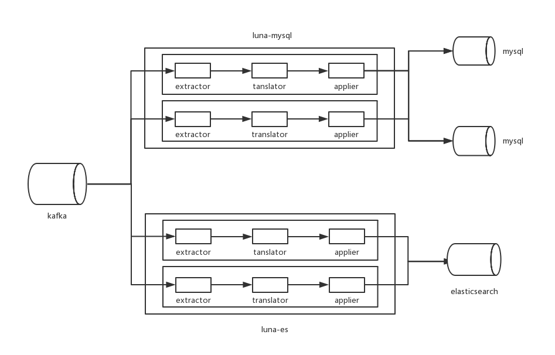

# luna-mysql
基于binlog的异步增量实现MySQL分库分表（kafka做数据源）

# Kafka数据源
要求MySQL的每张表对应Kafka的一个topic，topic命名为schema_table，partition规则随意。luna-mysql会对每个topic用1个线程消费处理，执行分表逻辑以及入库。关于Maxwell以及Kafka基本配置详见[Luna-es]

# 架构

# 配置及说明
请在conf下添加3个配置文件：example.yml, kafka_client_jass.conf, DingDing.yml

### example.yml

    NewKafka:
      topics:
        - schema0_table0
        - schema1_table1
      bootstrap.servers: xx.xx.xx.xx:9092,xx.xx.xx.xx:9092,xx.xx.xx.xx:9092 # write all to balance
      group.id: test_group # make sure group has permission
      max.fetch.byte: 1048576
      max.poll.records: 10000
      retry.times: 3
      retry.interval: 1000 # ms  
      purge.interval: 1 # minute/ How long you can fix bug(outside). The dead consumer will reborn 
    Mysql:
      source.url: jdbc:mysql://xx.xx.xx.xx:3306
      source.poolSize: "30"
      source.encode: UTF-8
      source.username: user
      source.password: "password" # "123456" not 123456
      split.table.detail:
        -
          schema: schema1
          table: table1
          split.column: field # The field accorded to split
          split.num: 4 
          target:
            -
              url: jdbc:mysql://xx.xx.xx.xx:3306
              username: user1
              password: "password" # "123456" not 123456
              poolSize: "30"
              encode: UTF-8
            -
              url: jdbc:mysql://xx.xx.xx.xx:3306
              username: user2
              password: "password" # "123456" not 123456
              poolSize: "30"
              encode: UTF-8
            -
              url: jdbc:mysql://xx.xx.xx.xx:3306
              username: user3
              password: "password" # "123456" not 123456
              poolSize: "30"
              encode: UTF-8
            -
              url: jdbc:mysql://xx.xx.xx.xx:3306
              username: user4
              password: "password" # "123456" not 123456
              poolSize: "30"
              encode: UTF-8
        -
          schema: schema2
          table: table2
          split.column: field # The field accorded to split
          split.num: 4 
          target:
            -
              url: jdbc:mysql://xx.xx.xx.xx:3306
              username: user1
              password: "password" # "123456" not 123456
              poolSize: "30"
              encode: UTF-8
            -
              url: jdbc:mysql://xx.xx.xx.xx:3306
              username: user2
              password: "password" # "123456" not 123456
              poolSize: "30"
              encode: UTF-8
            -
              url: jdbc:mysql://xx.xx.xx.xx:3306
              username: user3
              password: "password" # "123456" not 123456
              poolSize: "30"
              encode: UTF-8
            -
              url: jdbc:mysql://xx.xx.xx.xx:3306
              username: user4
              password: "password" # "123456" not 123456
              poolSize: "30"
              encode: UTF-8
              
### kafka_client_jass.conf 

Kafka 使用SASL_PLAINTEXT权限模块：[Authentication using SASL]

    KafkaClient {
      org.apache.kafka.common.security.plain.PlainLoginModule required
      username="user"
      password="password";
    };

### DingDing.yml (如果没有，注释掉src/main/java/luna/util/DingDingMsgUtil.java 的sendMsg方法的内容)

    url: https://oapi.dingtalk.com/robot/send?access_token=xxxxx
    isAtAll: false
    phonenumbers:
      - "xxxxxxxxxxx"

# 启动

建议mvn package后启动，默认conf/example.yml

控制台调试：

    bin/luna-mysql.sh conf/example.yml
    
nohup进程：

    bin/luna-mysql.sh -daemon conf/example.yml

--------------------------------
[Authentication using SASL]:https://docs.confluent.io/current/kafka/sasl.html "Authentication using SASL"
[Luna-es]:https://github.com/sanguinar/luna "Luna-es"
